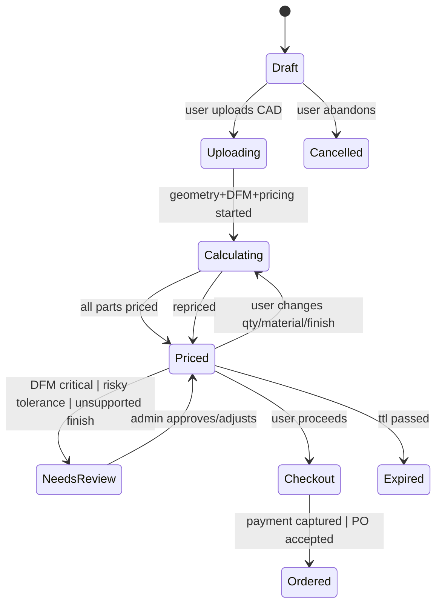

# Instant Quote Spec (Xometry Parity Oriented)

> October 2025 update: The Instant Quote experience is now gate-protected. Unauthenticated users see a landing page at `/instant-quote` with sign-in/sign-up calls to action. Uploads and quote creation require a Supabase session; when authenticated, the page renders the full instant quote workspace.

## Scope
Achieve feature parity (foundational) with Xometry-style instant quoting for CNC machining and sheet metal fabrication, supporting multi-part upload, configuration, dynamic pricing, DFM feedback, lead time selection, and admin overrides.

## Core Domains
1. File Ingestion & Geometry Extraction
2. Part Configuration (process/material/finish/tolerance/quantities/lead time)
3. Pricing Engine (multi-process, quantity breaks, rush, margins)
4. DFM Analysis (issues taxonomy, inline feedback loop)
5. Quote Assembly (multi-part, totals, overrides, status)
6. Checkout & Conversion (payment, order creation, deposit/PO future)
7. Admin Review & Margin Control
8. Notifications & Analytics

## Functional Requirements
### 1. Multi-Part Upload
- Drag & drop multiple CAD files (.STEP, .STP, .IGES, .STL, .DXF, .SLDPRT, .3MF, .X_T)
- Upload progress, cancel, retry
- Batch ingest -> create placeholder Quote + Part rows
- Extract geometry metrics per part: volume_cc, surface_area_cm2, bbox, feature counts
- Sheet metal detection + sheet params (thickness, flat pattern area, bend count)

### 2. Part Configuration Model (PartConfig)
Fields (initial canonical):
- id
- quote_id
- file_id
- process_type: cnc_milling | cnc_turning | sheet_metal_laser | sheet_metal_brake
- material_id
- material_spec(optional)
- finish_ids[]
- tolerance_class (standard | precision | high | custom)
- quantities[] (array of requested break quantities)
- selected_quantity
- lead_time_option (standard | expedited)
- secondary_operations[] (threading, tapping, anodizing, powder_coat, chem_film)
- inspection_level (basic | enhanced | full)
- geometry.metrics (from CAD extraction)
- dfm.status (pending | complete | failed)
- dfm.issues[] (taxonomy)
- pricing.status (pending | ready | review_required)
- pricing.breakdowns { quantity -> PricingBreakdown }
- overrides { unit_price?, lead_time_days? }
- audit { created_at, updated_at }

### 3. Pricing Engine v2
- Input: PartConfig + geometry metrics + pricing profile + material price + finish multipliers + lead time multiplier
- Support multi-quantity array: compute unit & total for each requested quantity
- Support per-process formulas
- Rush lead time multiplier & min guardrails
- Return PricingBreakdown: { material, machining, setup, finish, inspection, overhead, margin, total_cycle_time_min, machine_time_min }

### 4. Lead Time Estimation
Heuristic per process: base_cycle_time -> batch_time -> queue_factor -> expedite factor.

### 5. DFM Taxonomy
Issue fields: id, severity (info|warn|critical), category (undercut, thin_wall, deep_hole, bend_radius, tolerance_risk, material_flag), message, recommendation, refs { face_ids?, feature_ids? }, auto_fixable?

### 6. Admin Review & Margin Overrides
- Admin can lock quote, adjust margin %, set manual unit price per part
- System stores internal_cost vs customer_price
- Audit trail (who, when, before/after)

### 7. Quote Lifecycle (extended)
- draft -> processing (pricing/dfm running) -> ready -> sent -> accepted -> converted (order) -> expired/cancelled

### 8. Analytics Events
Events: upload_started, upload_completed, geometry_extracted, dfm_completed, pricing_completed, quote_ready, user_config_changed, admin_override_applied, quote_sent, quote_accepted.

## Non-Functional Requirements
- Real-time updates (websocket or polling) for DFM/pricing completion
- Resumable uploads (future) / MD5 integrity check
- Deterministic pricing for same inputs
- Idempotent re-pricing on config changes

## Data Model Additions (Proposed Tables)
- quote_parts (extends quote_items) with config JSONB (PartConfig snapshot)
- part_pricing_cache (quote_part_id, quantity, breakdown JSONB, hash(signature))
- dfm_analysis (quote_part_id, status, issues JSONB, metrics JSONB)
- admin_overrides (quote_part_id, field, previous, next, actor_id, created_at)
- material_catalog, finish_catalog, process_capabilities (if not present)

## API Endpoints (Draft)
- POST /quotes (create empty or from upload)
- POST /quotes/:id/parts/upload-initiate -> signed URLs array
- POST /quotes/:id/parts/:partId/config -> update part config (partial)
- POST /quotes/:id/parts/:partId/price -> recalc selected quantities
- GET /quotes/:id/parts/:partId/dfm
- POST /quotes/:id/parts/:partId/override
- POST /quotes/:id/send
- POST /quotes/:id/accept

## Websocket Channels (Option)
- quote:{id}:updates (events with part pricing/dfm progress)

## Frontend Layout (Customer)
- Left Pane: Parts list (status icons: upload, dfm, priced)
- Center Tabs: 3D Viewer | Configuration | DFM Issues
- Right Panel: Dynamic Pricing & Lead Time selector per quantity tier

## Admin Layout
- Grid of parts with cost vs price deltas
- Margin slider / manual override fields
- DFM issues summary & risk flags

## Gaps vs Current Implementation (High Level)
See GAP_ANALYSIS.md.

## Next Steps
1. Complete gap analysis.
2. Implement PartConfig shared contract under contracts/v1.
3. Adapt backend quote_items to store config & pricing caches.
4. Real file upload pipeline.
5. Geometry extraction enrichment in cad-service.
6. Pricing Engine v2 multi-quantity.
7. DFM taxonomy standardization.
8. Real-time update channel.

## Quote Lifecycle and Admin Review Triggers (Phase 3)

States
- Draft → Uploading → Calculating → Priced
- Optional branch: NeedsReview (manual review required)
- Customer edits (qty/material/finish) → Calculating → Repriced
- Checkout → Ordered
- Terminal: Expired | Cancelled

Mermaid

Admin review triggers
- DFM severity critical present
- Tolerance risk above threshold (configurable)
- Unsupported material/finish combination
- Margin guardrails breached (below min margin)

Event mapping
- user uploads → POST /quotes/:id/parts/upload-initiate → websocket: geometry_extracted/dfm_completed/pricing_completed
- user changes config → POST /quotes/:id/parts/:partId/price (recalc) + realtime updates
- admin approves/overrides → POST /admin/review/:quoteId/actions

Observability
- Spans: pricing.realtime.connect, pricing.calculate, pricing.recalculate
- Attributes: traceId, quoteId, partId, orgId
